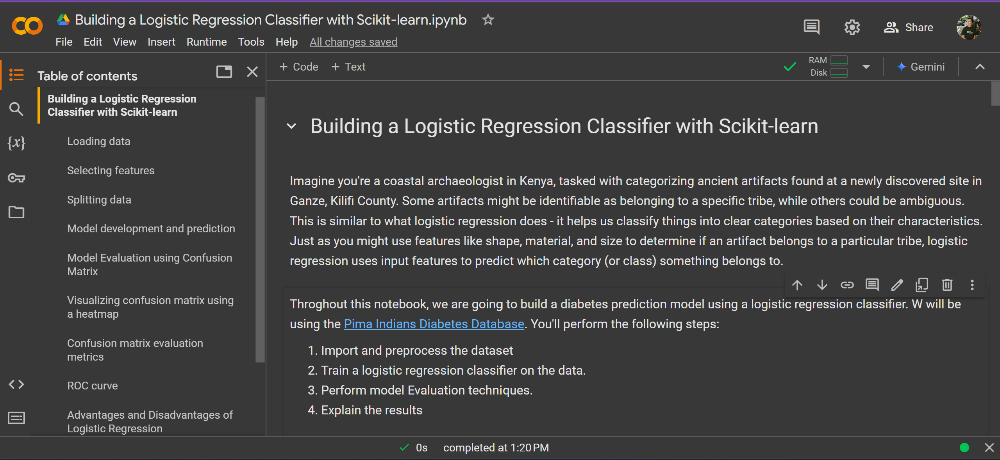

# Logistic Regression

Imagine you're a coastal archaeologist in Kenya, tasked with categorizing ancient artifacts found at a newly discovered site in Ganze, Kilifi County. Some artifacts might be identifiable as belonging to a specific tribe, while others could be ambiguous. This is similar to what logistic regression does - it helps us classify things into clear categories based on their characteristics. Just as you might use features like shape, material, and size to determine if an artifact belongs to a particular tribe, logistic regression uses input features to predict which category (or class) something belongs to.

Logistic regression takes this concept further by categorizing and estimating the probability of something belonging to each category. It's like giving you not just "yes" or "no" but "I'm 80% sure this artifact belongs to Tribe A". This makes it incredibly useful in real-world applications like spam filtering (probability of being spam), disease diagnosis (probability of having cancer), or credit risk assessment (probability of defaulting on a loan). The inner workings involve using a special mathematical function called the sigmoid function to map our input features into probabilities between 0 and 1.

In this Lesson, we'll explore how logistic regression works under the hood, including its key component - the sigmoid function. We'll compare it to linear regression, highlighting their differences in both output and application. By the end of the Lesson, you should be able to understand the fundamental concepts of logistic regression, implement a simple model in Python, and appreciate its role in machine learning applications. We'll delve into how you can evaluate your model using a confusion matrix and other evaluation metrics.


## Table of Contents

- [🎧 Overview](#-overview)
- [🛠 Prerequisites and Installation Guide](#-prerequisites-and-installation-guide)
- [📚 Workshop Lessons](#-workshop-lessons)
- [🚀 What's Next?](#-whats-next)
- [📑 Further Resources](#-further-resources)
- [👩🏽‍💻 Contributors Guide](#-contributors-guide)
- [⚖️ License](#️-license)

---

This repository contains the lesson materials, lesson notes, machine learning model notebooks, serilized models, and links to further resources. You can follow the workshop lessons and build the project yourself or use the materials to learn at your own pace.

In this lesson, we will build:

- A minimal diabetes disease prediction model using a logistic regression classifier. ([`/model`](./model)).





---

## 🎧 Overview

### Lesson Objectives 

**Lesson duration**: ~fifteen (15) minutes.

At the end of this lesson; you should be able to:

- Understand the concept of logistic regression and its purpose
- Learn about the sigmoid function and its role in logistic regression
- Implement a simple logistic regression model in Python
- Understand the difference between linear regression and logistic regression


## 🛠 Prerequisites and Installation Guide

Generally, you need the following:

- A curious mind and desire to learn.
- A working laptop running on any operating system (Windows, Linux, or macOS).
- Ability to navigate through the command-line interface (CLI).
- Some existing machine learning model development knowledge (or an interest at least).
- Some basic understanding of the Python programming language.

To make the workshop a smooth process, we will use [Google Colab](https://colab.google?utm_source=bk-logistic-regression-lesson) for the machine learning model development. This will enable us to run a hosted Jupyter Notebook on the cloud (with GPU and TPU computing resources) and avoid issues with installing all the Python packages locally (the future is cloud!). All you have to do is create a free Google account if you don't have one already and open the Notebook in Google Colab.

But if you prefer local, you should install [Anancoda](https://anaconda.com/download?utm_source=bk-logistic-regression-lesson) to use Jupyter Notebook on your local computer. You will need to install and import all the required packages yourself too and resolve any conflicts that might arise.

> [!NOTE]
>
> [Jupyter Notebooks](https://jupyter.org?utm_source=bk-logistic-regression-lesson) allow you to combine executable code and rich text in a single document, along with images, HTML, LaTeX, and more.

---

You should have the following software and packages installed on your computer. Kindly follow the guide in each toggle to install them.

<details>

<summary>Git and GitHub</summary>
<br />

We will install/use the following packages:

- [Git](https://git-scm.com/downloads?utm_source=bk-logistic-regression-lesson): a free and open-sourced distributed version control system.
- [GitHub](https://github.com?utm_source=bk-logistic-regression-lesson): a code hosting platform for version control and collaboration.

Download and install Git from [this website](https://git-scm.com/downloads?utm_source=bk-logistic-regression-lesson) for all operating systems or follow this [installation guide](https://git-scm.com/book/en/v2/Getting-Started-Installing-Git?utm_source=bk-logistic-regression-lesson).

Once installed successfully, confirm the version using the command:

```bash
git --version
```

<br />

Next, create a [free GitHub account](https://github.com/signup?utm_source=bk-logistic-regression-lesson) if you don't have one already.

> [!NOTE]
>
> Bonus: If you're a student, you should check out the [GitHub Student Developer Pack](https://education.github.com/pack?utm_source=ba-deploy-ml-web-workshop), which gives students free access to the best developer tools (paid tools/services/courses for free) in one place so they can learn by doing.

</details>

<details>

<summary>Python and PIP</summary>
<br />

We will install the following packages:

- [Python](https://python.org?utm_source=bk-logistic-regression-lesson): a general-purpose programming language that lets you work quickly and integrate systems more effectively.
- [PIP](https://pypi.org/project/pip?utm_source=bk-logistic-regression-lesson): a package manager for installing Python packages or modules.

Download and install Python 3 (`>3.10.12`) from [this website](https://python.org/downloads?utm_source=bk-logistic-regression-lesson) for all operating systems (this will come with PIP in-built).

> [!IMPORTANT]
>
> Please specifically download and install a version `3.10.12` or higher (I'm using `3.11.5`). Google Colab will install version `3.10.12` which we will use to develope a machine learning model and anything less on your local machine will result in errors when using the serilized model.

Once installed successfully, confirm the version using the command:

```bash
python3 --version
```

If Python is installed correctly, you should have PIP installed. If it isn't, follow the steps in [this guide](https://pip.pypa.io/en/stable/installation?utm_source=bk-logistic-regression-lesson) to install PIP.

</details>

<details>

<summary>Other Python Packages</summary>
<br />

We will install the following packages:

- [Python Dotenv](https://pypi.org/project/python-dotenv?utm_source=ba-deploy-ml-web-workshop): a package that reads key-value pairs from a `.env` file and can set them as environment variables.
- [Scikit-Learn](https://scikit-learn.org/stable?utm_source=ba-deploy-ml-web-workshop): a free software machine learning library for the Python programming language, including various classification, regression, and clustering algorithms.

> [!IMPORTANT]
>
> Eventually, we will install the above mentioned libraries in a [virtual environment](https://packaging.python.org/en/latest/guides/installing-using-pip-and-virtual-environments/#creating-a-virtual-environment?utm_source=bk-logistic-regression-lesson) to ensure we use independent groups of Python libraries for each project. This is a recommended practice when building Python aplications in both development and production.

In the project directory, create the environment with the command `python3 -m venv .venv` and activate the envirnment with the command `source .venv/bin/activate`.

Now, install all of the packages using the command below:

```bash
pip3 install python-dotenv scikit-learn
```

<br />

Once installed successfully, confirm the version using the command:

```bash
pip3 show python-dotenv

pip3 show scikit-learn
```

</details>


## 📚 Workshop Lessons

1. [Overview & Introduction to Machine Learning](./lessons/01.md)
2. [Concept of Logistic Regression](./lessons/02.md)
3. [Logistic Regression vs Linear Regression](./lessons/03.md)
4. [The Sigmoid Function](./lessons/04.md)
5. [Building a Logistic Regression Classifier with Scikit-learn](./lessons/05.ipynb)
6. [Interpretation and Evaluation](./lessons/05.ipynb)

## 🚀 What's Next?

- Challenge: as discussed in [lesson five](./lessons/05.ipynb), we have been able to build a logistic regression classifier. Using that understanding work on the challenge below 

<details>

<summary>Coastal Artifact Categorization Challenge</summary>
<br />

**Objective**: To practice applying logistic regression to a real-world scenario involving binary classification of coastal artifacts.

**Instructions:**

1. Using Python, create a dataset of coastal artifacts found in Ganze, Kilifi County, Kenya. Include the following features:
    - Material (rock, bone, wood, metal)
    - Age (prehistoric, historical, modern)
    - Size (small, medium, large)
    - Design (simple, intricate)
    - Weight (light, heavy)
2. Create a target variable that categorizes the artifacts as either "Cultural Significance" (highly valued by local communities) or "Not Significant" (of little cultural value).
3. Split your dataset into training and testing sets.
4. Implement logistic regression using scikit-learn to predict the Cultural Significance of artifacts based on the input features.
5. Train your model using gradient descent optimization.
6. Evaluate your model using metrics such as accuracy, precision, recall, and F1-score.
7. Visualize the decision boundary of your model using matplotlib.
8. Perform feature selection to identify the most important factors in determining cultural significance.
9. Compare the performance of your logistic regression model with other classification algorithms (e.g., SVM, Random Forest).
10. Discuss potential limitations of your model and ways to improve it.
11. Present your findings in a short report, including:
    - Summary of the dataset
    - Model architecture and hyperparameters
    - Performance metrics
    - Insights gained from feature selection
    - Comparison with alternative models
    - Recommendations for future improvements

</details>
<br />

- Build something nice for fun to test all you've learned, open-source the code, and write about it if you want.
- Tag me on X (Twitter) [@Kai_mwanyumba](https://twitter.com/Kai_mwanyumba) when you share your project.
- Open an issue in this repository or DM me [@Kai_mwanyumba](https://twitter.com/Kai_mwanyumba) if you have any questions or need help with anything.

## 📑 Further Resources

- [Google's Machine Learning Crash Course](https://developers.google.com/machine-learning/crash-course?utm_source=bk-logistic-regression-lesson)
- [Google's Machine Learning Glossary](https://developers.google.com/machine-learning/glossary?utm_source=bk-logistic-regression-lesson)


## 👩🏽‍💻 Contributors Guide

1. Fork [this repository](https://github.com/BolajiAyodeji/deploy-ml-web-workshop) (learn how to do this [here](https://help.github.com/articles/fork-a-repo)).

2. Clone the forked repository like so:

```bash
git clone https://github.com/<your username>/deploy-ml-web-workshop.git && cd deploy-ml-web-workshop
```

3. Make your changes and create a pull request ([learn how to do this](https://docs.github.com/en/github/collaborating-with-issues-and-pull-requests/creating-a-pull-request)).

4. I will attend to your pull request, provide some feedback, request some changes, or eventually merge the PR!

## ⚖️ License

The content of this repository &copy; 2024 by [Brayan Kai](https://github.com/mwanyumba7) is published under the [Creative Commons Attribution-ShareAlike 4.0 International](https://creativecommons.org/licenses/by-sa/4.0) license and the underlying code examples are licensed under the [MIT](LICENSE) license.

<p xmlns:cc="http://creativecommons.org/ns#" xmlns:dct="http://purl.org/dc/terms/"><a href="https://creativecommons.org/licenses/by-sa/4.0/?ref=chooser-v1" target="_blank" rel="license noopener noreferrer" style="display:inline-block;"></a></p>
