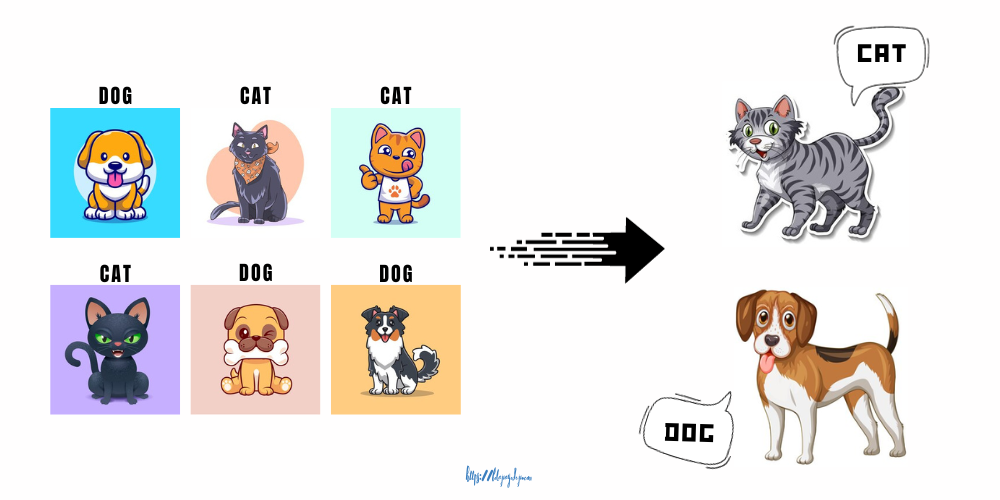
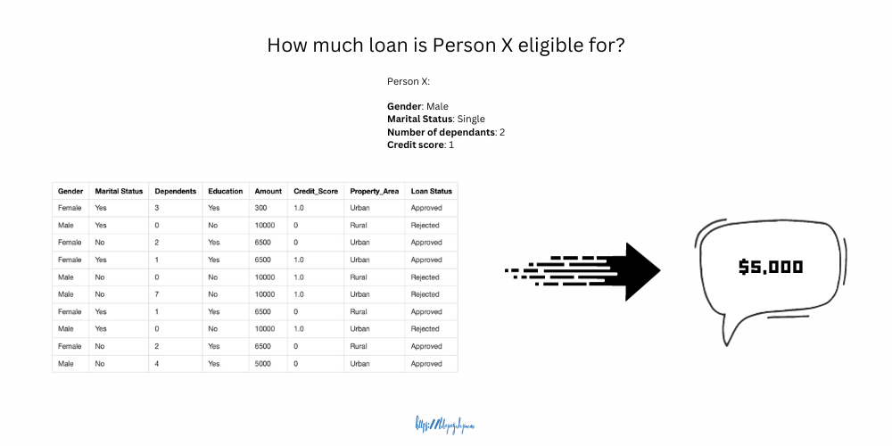
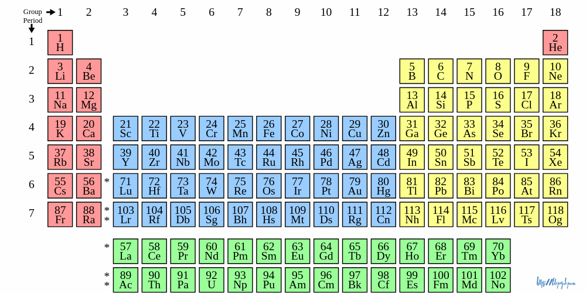
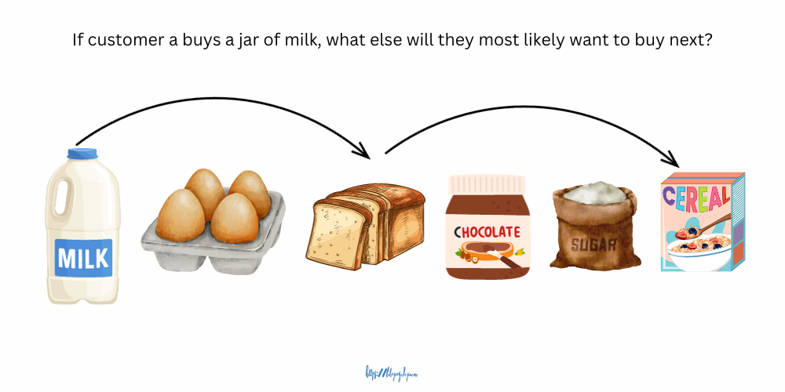

# Introduction to Machine Learning

---

## Table of Contents

- [Overview](#overview)
- [Categories of Machine Learning](#categories-of-machine-learning)
  - [Supervised Learning](#supervised-learning)
  - [Unsupervised Learning](#unsupervised-learning)
  - [Reinforcement Learning](#reinforcement-learning)
- [Artificial Intelligence (AI) vs. Machine Learning (ML)](#artificial-intelligence-ai-vs-machine-learning-ml)

---

## Overview

You may already be familiar with traditional programming, where you start with a goal, write logical rules, and refine it through testing until it works the way you want it to

Imagine trying to describe a cultural artifact from Kilifi using traditional programming rules. This approach would get very complicated, especially if you wanted to account for all of the possible ways one could draw an object.

Machine learning is an alternative approach to building software. Instead of programmers creating the rules, a model is trained with examples. Rather than trying to define for the computer what a cultural artifact is and account for all of the possibilities, the computer is given lots of varying examples and told this is a cultural artifact, this is a cultural artifact, and this is a cultural artifact.This approach results in a more flexible understanding.

Machine Learning is a branch of artificial intelligence (AI) and computer science. It is a collection of algorithms and statistical techniques used to create computational systems that learn from data in order to make predictions, intelligent decisions, and inferences.

On the other hand, a machine learning model is a program that has been trained using a specific dataset to recognize certain types of similar patterns and make informed predictions. You provide a model with a data set and train it with some algorithms. When you introduce new data, the model will use learned knowledge to recognize the new data set.

Some example use cases:

- Object detection and face recognition security systems where the device recognizes your face as a human face (and not an object) and grants entry upon authorized access.
- Image recognition, medical image analysis, disease prediction, personalized treatment plans, drug discovery, etc.
- Recommendation systems like product recommendations (e.g., Amazon, Netflix) and content suggestions (e.g., Spotify, YouTube).
- Sentiment analysis, trend prediction, customer behavior analysis, chatbots, language translation, speech recognition, text summarization, etc.
- Identifying unusual patterns or outliers in data, such as fraud detection in finance or network security.
- Detecting emotions from facial expressions or speech (voice recognition).
- Converting handwritten text into digital format and further using that to solve math problems.
- Assessing creditworthiness and determining lending risk for individuals or businesses.
- And much more!

[~Image source](https://developers.google.com/machine-learning/crash-course?utm_source=ba-deploy-ml-web-workshop)

## Categories of Machine Learning

There are three paradigms used to develop machine learning models. Let's discuss them briefly.

> **Note**
>
> All data and illustrations described below are synthetic, hypothetical, and randomly generated. They are not real data and are only used for explanation purposes. I (*Brayan*) will share more context during the lesson.

### Supervised Learning

This is a type of ML where an algorithm is given a large input dataset with corresponding output or event/class, usually prepared in consultation with the subject matter domain expert ("supervisor"). Consider the *example* data in Table 1.0 below with some animal images and their corresponding labels. The table represents a collection of data points; each column represents a **feature** or **attribute**, and each row represents labelled data (cat or dog). The last column usually represents the **target** or **label** or **output variable**. The algorithm will use this data to learn the relationship between the features (animal images, in this case) and the target output. So, after training and testing the model, when you provide a new image, the model will use the learned knowledge to predict the label of the new image.

Table 1.0

 

| Image | Label |
| ---   | ---   |
|  | Cat |
|  | Cat |
|  | Dog |
|  | Cat |
|  | Dog |
|  | Dog |

> Image credits: the beautiful animal illustrations are from [freepik.com](https://freepik.com?utm_source=bk-logistic-regression-lesson).

Table 2.0 (Another example with multiple features)

 

| Gender | Marital Status | Dependents | Education | Amount | Credit_Score | Property_Area | Loan Status |
|-------|-------|-------|-------|-------|-------|-------|-------|
| Female | Yes | 3 | Yes | 300 | 1.0 | Urban | Approved |
| Male | Yes | 0 | No | 10000 | 0 | Rural | Rejected |
| Female | No | 2 | Yes|  6500 | 0 | Urban | Approved |
| Female | Yes | 1 | Yes | 6500 | 1.0 | Urban | Approved |
| Male | No | 0 | No | 10000 | 1.0 | Rural | Rejected |
| Male | No | 7 | No | 10000 | 1.0 | Urban | Rejected |
| Female | Yes | 1 | Yes | 6500 | 0 | Rural | Approved |
| Male | Yes | 0 | No | 10000 | 1.0 | Urban | Rejected |
| Female | No | 2 | Yes | 6500 | 0 | Rural | Approved |
| Male | No | 4 | Yes | 5000 | 0 | Urban | Approved |

 

Supervised learning is further classified into two **main** categories of algorithms:

| Category | Description | Example |
| ----  | ---- | ---- |
| **Classification** | Multiple output variables (classes) (e.g, "Dog or Cat", "Positive or Negative", "Yes or No", etc.). |  |
| **Regression** | Single output variable that is a real or continuous value ("Price" or "Age" or "Weather" or "Weight".). |  |

### Unsupervised Learning

This is a type of ML where an algorithm is given some input dataset without the desired output or event/class and subject matter domain expert consultation. Consider the *example* data in Table 3.0 below with some data of individuals who applied for a mortgage (you'd observe that there are no corresponding labels that will tell the algorithm what the result should be—approved or rejected). The table represents a collection of data points; each column represents a **feature** or **attribute**, and each row represents unlabelled data. The algorithm will use this data to learn the unique qualities, similarities, patterns, and differences between the features without labelled guidance. So, after training the model, the model will use the self-learned knowledge to predict the loan status of a new applicant.

Table 3.0

 

| Gender | Marital Status | Dependents | Education | Amount | Credit_Score | Property_Area |
|--------|--------|--------|--------|--------|--------|--------|
| Female | Yes | 3 | Yes | 300 | 1.0 | Urban |
| Male | Yes | 0 | No | 10000 | 0 | Rural |
| Female | No | 2 | Yes|  6500 | 0 | Urban |
| Female | Yes | 1 | Yes | 6500 | 1.0 | Urban |
| Male | No | 0 | No | 10000 | 1.0 | Rural |
| Male | No | 7 | No | 10000 | 1.0 | Urban |
| Female | Yes | 1 | Yes | 6500 | 0 | Rural |
| Male | Yes | 0 | No | 10000 | 1.0 | Urban |
| Female | No | 2 | Yes | 6500 | 0 | Rural |
| Male | No | 4 | Yes | 5000 | 0 | Urban |

 

Unsupervised learning is further classified into two **main** categories of algorithms:

| Category | Description | Example |
| ----  | ---- | ---- |
| **Clustering** | Grouping the data based on similarities and differences to identify those with similar properties.  |    
 ~Image credits: the periodic table is from [Wikipedia](https://en.wikipedia.org/wiki/Group_%28periodic_table%29?utm_source=bk-logistic-regression-lesson). 
 |
| **Association** | Finding corelations or occurences in the data using some rules and mapping the data based on the observed dependency information. |  |

### Reinforcement Learning

I won't go into full details for this one but will briefly define it and give some examples. This type of ML algorithm maps situations to actions that result in the highest possible reward (maximizing the reward and minimizing penalty to increase the total reward achieved). The program (mostly called agent) learns without intervention from a human but from its own experiences and interactions with the environment. The agent learns from its own mistakes and tries to improve its performance based on the consequences of its actions. The agent learns what to do and what not to do from the feedback given by the environment.

Consider the example of a dog barking towards a stranger. The dog will learn that barking at strangers is good and will continue to do so. However, suppose the dog barks at a family member and receives a negative response. In that case, it will learn that barking at family members is bad and will stop doing so. If the dog doesn't bark at a family member and receives a bone as a reward, it will stop barking towards family members. The more the reward and response, the more the dog adjusts. The dog therefore learns from its own experiences and interactions with the environment.

Some real-world examples include self-driving cars, robotics, games, personalized medical treatment plans/prosthetics, algorithmic trading,  etc.

To conclude, I'll quote [Wikipedia's](https://en.wikipedia.org/wiki/Reinforcement_learning?utm_source=bk-logistic-regression-lesson) succinct summary of how reinforcement learning works:

> "Reinforcement learning differs from supervised learning in not needing labelled input/output pairs to be presented, and in not needing sub-optimal actions to be explicitly corrected. Instead the focus is on finding a balance between exploration (of uncharted territory) and exploitation (of current knowledge)."

---

In summary and to contrast:

|  | Supervised Learning | Unsupervised Learning | Reinforcement Learning |
| ---- | ---- | ---- | ---- |
| **Number of Classes** | Known | Unknown | Unknown |
| **Input** | Labeled data | Unlabeled data | Data or Feedback |
| **Output** | Predictions | Discover (hidden or interesting) patterns | Optimal actions |
| **Computational Complexity** | Low | High | High |
| **Accuracy** | High | Low | High |
| **Reliability** | Yes | Yes | Yes |
| **Example(s)** | Image classification, Speech-to-text, sentiment analysis, etc. | Anomaly detection, image recognition, recomendation engines, etc. | Self-driving cars, robotics, digital games, etc. |

## Artificial Intelligence (AI) vs. Machine Learning (ML)

**[Artificial Intelligence](https://en.wikipedia.org/wiki/Artificial_intelligence?utm_source=bk-logistic-regression-lesson)** is a broad term that refers to the ability of a machine or system to perform tasks that require human intelligence. **[Machine Learning](https://en.wikipedia.org/wiki/Machine_learning?utm_source=bk-logistic-regression-lesson)**, on the other hand, is a subset of Artificial Intelligence that uses statistical techniques to enable machines to improve their experience at performing tasks. There are other subsets like **[Deep Learning](https://en.wikipedia.org/wiki/Deep_learning?utm_source=bk-logistic-regression-lesson)** that use neural networks to allow machines to improve their experience at performing tasks.

---

Thank you for coming this far; you've done well 👏🏾. Please open a new GitHub discussion using the links below and let me know your thoughts about this module or any issues you're experiencing.

[Share Feedback](https://github.com/mwanyumba7/logistic-regression-lesson/discussions/new?category=feedback) | [Ask Question](https://github.com/mwanyumba7/logistic-regression-lesson/discussions/new?category=q-a)

---

<< previous lesson | [next lesson](./02.md) >>

