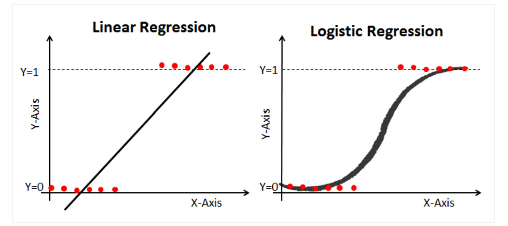

# Logistic Regression vs Linear Regression

---

## Table of Contents

- [Overview](#overview)
- [Under the Hood](#under-the-hood)
- [When to Choose Each](#when-to-choose-each)

---

## Overview

Linear regression gives you a continuous output, but logistic regression provides a constant output.
Let's imagine you're running a beachside ice cream stand in Mombasa, Kenya. You want to predict sales based on temperature and advertising spending. This scenario illustrates the key differences between linear regression and logistic regression.



## Under the Hood

### Output: Continuous vs Binary Classification

Linear regression predicts continuous values, like the exact number of ice creams sold. It's like predicting the total number of cones you'll sell today.

Logistic regression predicts binary classifications, like "Will it rain?" (Yes/No). It's like predicting whether you'll need to close your stand due to bad weather.

### Cost Function: Mean Squared Error vs Cross-Entropy

Linear regression uses mean squared error as its cost function. This measures how far off your predictions are from the actual values.

Logistic regression uses cross-entropy as its cost function. This measures how well your model predicts probabilities.

```python
import numpy as np
from sklearn.linear_model import LogisticRegression
from sklearn.linear_model import LinearRegression

# Sample data
X = np.array([[1], [2], [3], [4]])
y_binary = np.array([0, 1, 1, 0])
y_continuous = np.array([2, 3, 5, 7])

# Logistic Regression
logreg = LogisticRegression()
logreg.fit(X, y_binary)

print("Logistic Regression Coefficients:", logreg.coef_)
print("Logistic Regression Intercept:", logreg.intercept_)

# Predict probabilities
probabilities = logreg.predict_proba(X)
print("Predicted Probabilities:\n", probabilities)

# Linear Regression  
linreg = LinearRegression()
linreg.fit(X, y_continuous)

print("\nLinear Regression Coefficients:", linreg.coef_)
print("Linear Regression Intercept:", linreg.intercept_)

# Predict continuous values
continuous_predictions = linreg.predict(X)
print("\nContinuous Predictions:\n", continuous_predictions)
```

### Interpretation: Predicted Values vs Probabilities

Linear regression gives you predicted values directly. You can say "If temperature is X and advertising spend is Y, I predict we'll sell Z ice creams."

Logistic regression gives you probabilities. You can say "Given temperature X and advertising spend Y, there's a 75% chance it will rain tomorrow."

This makes logistic regression particularly useful for predicting binary outcomes where probability is more meaningful than an exact count.

### Assumptions
Logistic regression assumes a binomial distribution of the dependent variable, whereas linear regression assumes a normal distribution. This is because logistic regression is used for categorical variables, which follow a binomial distribution, whereas linear regression is used for continuous variables, which follow a normal distribution.

## When to Choose Each

Logistic regression is used for categorical variable estimation, such as predicting the probability of an event occurring, whereas linear regression is used for continuous variable estimation, such as predicting a numerical value. For example, logistic regression can be used to predict the probability of a customer defaulting on a loan, whereas linear regression can be used to predict the price of a house.

Choose linear regression when:
- You're predicting continuous values
- The relationship between variables is linear
- You need precise numerical predictions

Choose logistic regression when:
- You're predicting binary classifications
- The relationship between variables isn't necessarily linear
- You want to estimate probabilities of an event occurring

By understanding these differences, you'll be better equipped to choose the right tool for your specific problem, whether you're forecasting ice cream sales or predicting weather patterns in Kenya's coastal regions.


---

<div align="center">

Thank you for coming this far; you've done well 👏🏾. Please open a new GitHub discussion using the links below and let me know your thoughts about this lesson or any issues you're experiencing.

[Share Feedback](https://github.com/mwanyumba7/logistic-regression-lesson/discussions/new?category=feedback) | [Ask Question](https://github.com/mwanyumba7/logistic-regression-lesson/discussions/new?category=q-a)

---

<< [previous lesson](./02.md) | [next lesson](./04.md) >>

</div>
