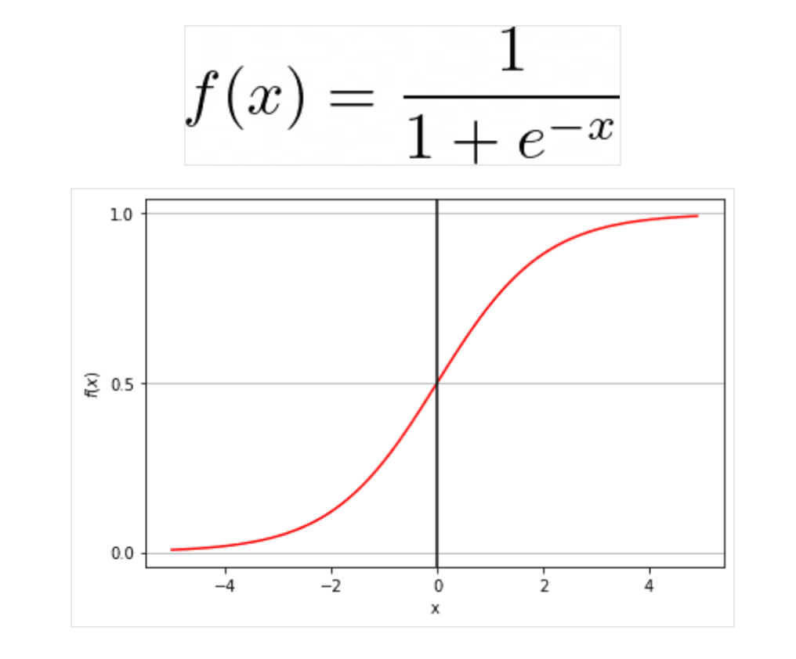

# The Sigmoid Function

---

## Table of Contents

- [Overview](#overview)
- [Under the Hood of The Sigmoid Function](#under-the-hood-of-the-sigmoid-function)
- [Implementation with Python](#implementation-with-python)

---

## Overview

We know that Logistic regression is used when we want to predict something that has two possible outcomes, like whether a toy is red or blue, or whether it will rain tomorrow or not.

Instead of a straight line, logistic regression uses an S-shaped line. This line helps us figure out the probability of something happening.

The S-shaped line is called a sigmoid function. It looks like a stretched-out letter "S". The lower part of the "S" represents a low probability, while the upper part represents a high probability.



## Under the Hood of The Sigmoid Function

The sigmoid function is defined as: `f(x) = 1 / (1 + e^(-x))`

Where e is the base of the natural logarithm.

Let's break this down:

- Input: We put our linear combination of inputs (features multiplied by weights) into the function.
- Exponential: A negative exponential is applied to this sum.
- Denominator: 1 is added to this exponential result.
- Final step: The whole expression is divided by the denominator.

This function has some key properties: 
1. It always outputs between 0 and 1 
2. It's symmetric around x=0 
3. As x approaches infinity or negative infinity, it approaches 1 or 0

## Implementation with Python

Let's visualize this function using Python:

```python
import numpy as np
import matplotlib.pyplot as plt

# Create an array of x values from -5 to 5
x = np.linspace(-5, 5, 400)

# Calculate corresponding y values using the sigmoid function
y = 1 / (1 + np.exp(-x))

# Create the plot
plt.figure(figsize=(10, 6))
plt.plot(x, y)

# Add labels and title
plt.xlabel('Input')
plt.ylabel('Probability')
plt.title('Sigmoid Function')

# Set limits slightly bigger than range of function
plt.xlim([-5, 5])
plt.ylim([0, 1.1])

# Grid and show the plot
plt.grid(True)
plt.show()
```
This code will produce a graph showing how the sigmoid function maps inputs to probabilities between 0 and 1.

The sigmoid function plays a crucial role in logistic regression because it ensures that our model's output always represents a probability. This makes it easier to interpret results and make decisions based on our predictions.

In essence, the sigmoid function acts as a gatekeeper, allowing only outputs between 0 and 1, which is perfect for binary classification problems where we want to predict the likelihood of an event occurring.

---

<div align="center">

Thank you for coming this far; you've done well 👏🏾. Please open a new GitHub discussion using the links below and let me know your thoughts about this lesson or any issues you're experiencing.

[Share Feedback](https://github.com/mwanyumba7/logistic-regression-lesson/discussions/new?category=feedback) | [Ask Question](https://github.com/mwanyumba7/logistic-regression-lesson/discussions/new?category=q-a)

---

<< [previous lesson](./03.md) | [next lesson](./05.md) >>

</div>
